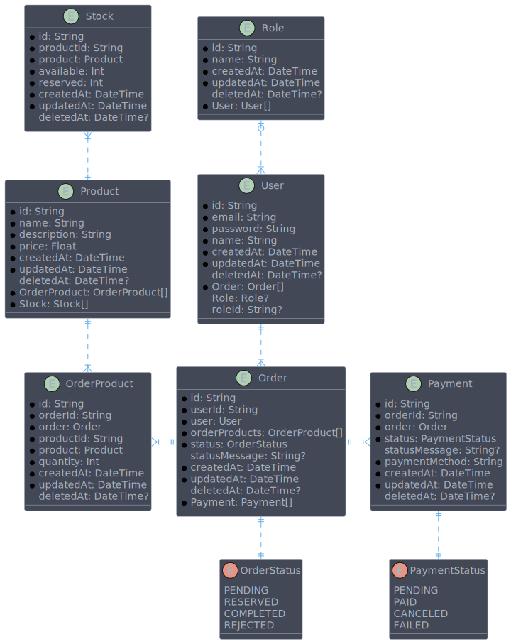

# Designli technical challenge

The goal is to build a robust and scalable backend API that manages a simplified e-commerce
system. The system should handle product management, user authentication, order processing,
and payment simulations using asynchronous processes. The API should follow best practices
for RESTful design, handle performance optimizations, ensure data consistency, and provide
scalability for high-concurrency scenarios.

## Running the project

### Requirements

To run the project, you will only need to have Docker installed on your machine. If you don't have it installed, you can download it [here](https://www.docker.com/products/docker-desktop).

### Setup environment variables

Before running the project, you need to create a `.env` file in the root directory of the project. You can copy the `.env.example` file and rename it to `.env`. The `.env` file should contain the following environment variables:

```env
# database
DB_PASSWORD=testdesignli
DATABASE_URL=postgres://postgres:testdesignli@db:5432/backend

# redis
REDIS_PASSWORD=testdesignli
REDIS_HOST=redis
REDIS_PORT=6379

# app.auth
JWT_SECRET=jwtsupersecret
JWT_EXPIRES_IN=1d

# app.throttler
THROTTLER_TTL=1000
THROTTLER_LIMIT=5

# app.jobs
BACKOFF_RETRIES=10
BACKOFF_DELAY=300

# app.payment
PAYMENT_FAILED_PROBABILITY=95
PAYMENT_DURATION=1000
```

> [!IMPORTANT]
> There is no need to deploy a PostgreSQL or Redis server. The project uses Docker to create containers for these services.

> [!TIP]
> The `JWT_SECRET` environment variable should be a random string to ensure the security of the JWT tokens. This can be generated using a tool like [randomkeygen](https://randomkeygen.com/).

#### Environment Variables

| Variable                     | Description                                                        |
| ---------------------------- | ------------------------------------------------------------------ |
| `DB_PASSWORD`                | The password for the PostgreSQL database.                          |
| `DATABASE_URL`               | The connection URL for the PostgreSQL database.                    |
| `REDIS_PASSWORD`             | The password for the Redis database.                               |
| `REDIS_HOST`                 | The host for the Redis database.                                   |
| `REDIS_PORT`                 | The port for the Redis database.                                   |
| `JWT_SECRET`                 | The secret key used to sign the JWT tokens.                        |
| `JWT_EXPIRES_IN`             | The expiration time for the JWT tokens.                            |
| `THROTTLER_TTL`              | The time-to-live for the rate limiting cache.                      |
| `THROTTLER_LIMIT`            | The maximum number of requests allowed in the rate limiting cache. |
| `BACKOFF_RETRIES`            | The number of retries for the exponential backoff strategy.        |
| `BACKOFF_DELAY`              | The delay between retries for the exponential backoff strategy.    |
| `PAYMENT_FAILED_PROBABILITY` | The probability of a payment failing (0-100).                      |
| `PAYMENT_DURATION`           | The duration of the payment simulation in milliseconds.            |

### Running the project

After installing Docker, you can run the project by executing the following command in the root directory of the project:

```bash
docker compose up
```

After running the command, the project will be pulled from Docker hub and started. After the project is started, you need to run the migrations and seed the database using the following commands:

```bash
cd technical-assessment
yarn npx prisma migrate deploy
yard npx prisma db seed
```

> [!IMPORTANT]
> Before running the migrations and seeding the database, you need to create a `.env` file with the `DATABASE_URL` environment variable.

After running the migrations and seeding the database, you can access the API by navigating to `http://localhost:3000/api`.

#### Running it locally

If you want to run the project locally, you need to setup a PostgreSQL and Redis server. After setting up the servers, you will need to setup the environment variables using the `.env.example` file that is provided in the the `technical-assesment` directory. You can copy the `.env.example` file and rename it to `.env`. After setting up the environment variables, you can run the project using the following commands:

```bash
yarn install
yarn start:dev
```
> [!TIP]
> You can deploy a database and a Redis server using the docker-compose file provided in the `technical-assessment` directory. But you will need to remove the server service from the docker-compose file.

## Requirements:

### Authentication and Authorization:

- Users should be able to register and log in to the system.
- Users should be able to access the API using a JWT token.
- Users should have different roles (admin and user).
- Admin users should be able to create, read, update, and delete products.
- Users should be able to create, and read orders.

### Product Management:

- Products should have a name, description, price, and quantity.
- Products should be listed, created, updated, and deleted.
- Products should be cached to improve performance.

### Order Management:

- Orders should have a status, total amount, and products.
- Orders should be created, and read.
- Payment should be simulated using a job queue.
- Orders should be processed asynchronously using job queues.
- Orders and payments should be updated in real-time using Websockets.

### Technical Requirements:

- The API should be built using the NestJS framework.
- The API should use PostgreSQL as the database.
- The API should use Redis for caching and job queues.
- The API should use Websockets for real-time updates.
- The API should have unit tests and integration tests.
- The API should be scalable, performant, secure, maintainable, and resilient.

### Endpoints:

#### User Management:

| Method | Endpoint  | Description                                        | Authentication | Authorization |
| ------ | --------- | -------------------------------------------------- | -------------- | ------------- |
| POST   | /register | Register a new user.                               | No             | No            |
| POST   | /login    | Log in a user, returning a JWT for authentication. | No             | No            |

#### Product Management:

| Method | Endpoint      | Description                                       | Authentication | Authorization |
| ------ | ------------- | ------------------------------------------------- | -------------- | ------------- |
| GET    | /products     | List all products.                                | No             | No            |
| GET    | /products/:id | Retrieve details of a specific product.           | No             | No            |
| POST   | /products     | Add a new product (authentication required).      | Yes            | admin         |
| PUT    | /products/:id | Update product details (authentication required). | Yes            | admin         |
| DELETE | /products/:id | Delete a product (authentication required).       | Yes            | admin         |

#### Order Management:

| Method | Endpoint    | Description                                                           | Authentication | Authorization |
| ------ | ----------- | --------------------------------------------------------------------- | -------------- | ------------- |
| POST   | /orders     | Place a new order (authentication required).                          | Yes            | user          |
| GET    | /orders/:id | Get details of a specific order (authentication required).            | Yes            | user          |
| GET    | /orders     | List all orders for the authenticated user (authentication required). | Yes            | user          |

## Solution

A backend API was built using the NestJS framework. The API provides endpoints for user management, product management, and order management. The API uses PostgreSQL as the database, Redis for caching and job queues and Websockets for real-time updates. The API has unit tests to ensure the quality of the codebase.

> [!IMPORTANT]
> This solution meets all listed requirements except for the automated integration tests, which were conducted manually using Postman.

### Project Architeture

#### ERD

The project uses a PostgreSQL database to store the data. The ERD diagram below shows the relationship between the entities in the database.



This design is based on a domain-driven approach applying star pattern schema concepts. The entities are designed based on the business requirements. They are divided into three main categories: **users**, **products**, and **orders**. 

#### Project Structure

The project is divided into several modules to separate the concerns and make the codebase more maintainable. The modules are:

- Modules	
	- auth: handles user authentication and authorization.
	- user: handles user management.
	- product-manager: handles product management, agregating the product and stock modules.
    	- product: handles product management.
    	- stock: handles stock management.
	- order-manager: handles order management, agregating the order, order-item, and payment modules.
    	- order: handles order management.
    	- payment: handles payment simulation.

Each module has its own controllers, services, dtos and entities. All database operations are managed by Prisma.

Some modules contain additional layers to handle specific concerns:

- Middleware: contains the authentication and authorization middleware.
- Cache: contains the cache layer to improve performance.
- Jobs: contains the job queues to simulate payment jobs.
- Websockets: contains the Websockets layer to provide real-time updates.

The project also contains a shared module that contains common utilities and constants used across the project.

### Authentication and Authorization

The API provides endpoints for user registration and login. It uses JWT tokens for authentication. The API also provides middleware to check if the user is authenticated and has the correct permissions before allowing them to access the API. This is done by using the `AuthGuard` and `RolesGuard` classes.

### Asynchronous Processes

The API uses BullMQ to handle job queues for processing orders and simulating payments. When a new order is created, a job is added to the queue to process the order asynchronously. 

Also, the project uses a job layer on the event emitters to guarantee that events are asynchronously processed and don't get lost. This layer is implemented in the `event-manager` Module.

### Websockets

The API uses Websockets to provide real-time updates for orders and payments. When an order is created or updated, a message is sent to the Websocket server, which then broadcasts the message to all connected clients on the corresponding channel.

### Cache

The API uses Redis to cache products to improve performance. When a product is created, updated, or deleted, the cache is invalidated to ensure data consistency.

### Rate Limiting and Throttling

The API uses the `@nestjs/throttler` package to implement rate limiting and throttling. The rate limiting is applied to all routes to prevent abuse and ensure the API is not overwhelmed by too many requests.

> [!NOTE]
> The rate limiting parameters are defined by the `THROTTLER_TTL` and `THROTTLER_LIMIT` environment variables.

### Payment Simulation

The API uses job queues to simulate payment processing. When an order is created, a job is added to the queue to simulate the payment process. The simulation is done by waiting an amount of time defined by the `PAYMENT_DURATION` environment variable. Also, the payment simulation is likely to fail, which is determined by the `PAYMENT_FAILED_PROBABILITY` environment variable. This simulates real-world scenarios where payments can fail and need to be retried using an exponential backoff strategy.

> [!NOTE]
> The strategy parameters are defined by the `BACKOFF_RETRIES` and `BACKOFF_DELAY` environment variables. The strategy is implemented in the job layer.

### API Documentation

The API documentation was generated using Swagger. You can access the documentation by navigating to `http://localhost:3000/api` after running the project.

### Testing

The project contains unit tests to ensure the quality of the codebase. The tests are located in the `test` directory and can be run using the following command:

```bash
yarn test
```

### TODO

- [x] Create a new project using the NestJS framework.
- [x] Create a RESTful API that allows users to create, read, update, and delete a user.
- [x] Create a RESTful API that allows users to create, read, update, and delete a Product.
- [x] Create authentication middleware that checks if the user is authenticated before allowing them to access the API.
- [x] Create authorization middleware that checks if the user has the correct permissions before allowing them to access the API.
- [x] Add Orders logic to the project.
- [x] Add Websockets to the project.
- [x] Add job queues to simulate payment jobs.
- [x] Add a job layer on the event emitters.
- [X] Add Cache layer to the project.
- [X] Add Unit tests to the project.
- [ ] Add Integration tests to the project.
  - [x] Integration tests using Postman.
- [x] Create a Dockerfile to build the project.
- [x] Create a docker-compose file to run the project.
- [x] Create Documentation for the project.
